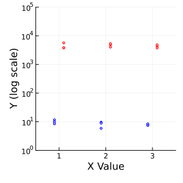
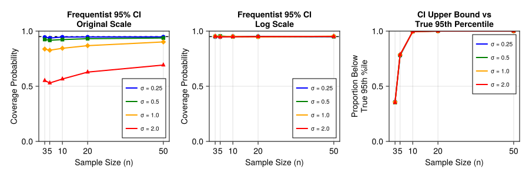
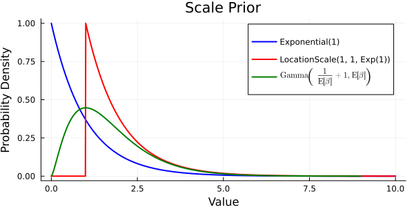
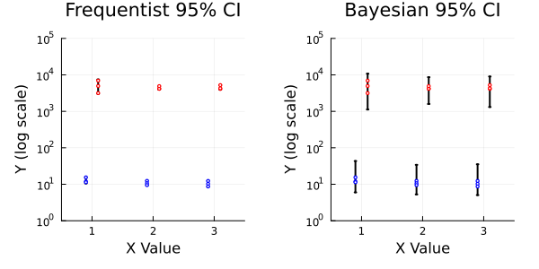
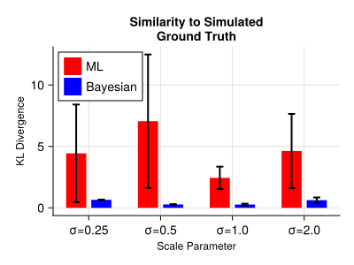

**Summary:**

- **Appropriate Transformation**: LogNormal distributed data must have uncertainty quantified in the log transformed space.
- **Uncertainty Underestimation**: Naive frequentist maximum likelihood 95% CI underestimate true uncertainty of right-skewed data due to the unknown scale parameter in the LogNormal likelihood. Complex estimation methods exist but $n=3$ samples stretches what is possible.
- **Bayesian Posterior Estimation**: A simple bayesian approach is proposed that better estimates the underlying distribution and uncertainty for LogNormal data. Partial pooling is used to estimate a posterior distribution for the scale parameter.
- **Consistent improvement**: The Bayesian approach provides superior distribution approximation across diverse parameter regimes. The model jointly estimates the posterior of the mean and scale parameters and allows precise quantification of derived statistics from the posterior.

---

## Overview

Biological data often span multiple orders of magnitude and are right-skewed from the mean. Standard visualization practice in biology transforms the data to log-space while adjusting axis labels to display the original scale. While this transformation aids visual interpretation, it encourages misinterpretation of uncertainty.



Below, I show that inference for LogNormal data must be conducted on the log-transformed scale where the parameters estimating the average are normally distributed. Consider the two groups in Figure 1 with medians at 10 and 7000 in the original scale. Correct inference requires evaluating the difference $\log(7000) - \log(10) \approx 6.55 - 2.30 = 4.25$ on the log scale where the data are normally distributed. Performing inference on the original scale leads to erroneous conclusions about effect sizes and confidence.

A bayesian method is proposed that better estimates the uncertainty from log-normal data.

## Standard CI Underestimate Uncertainty

Inferring 95% confidence intervals prior to log-transforming the data indisputably leads to incorrect 95% CI. Unsurprisingly, as the data becomes more skewed given $\sigma$, the odds that the 95% CI contains the true parameter value goes down. Transforming the data first then calculating 95% CI corrects this problem, as expected. However, normality assumptions against right-skewed data fail to capture upper tail behavior.

To demonstrate these issues, 10,000 datasets were simulated for various sample sizes (n = 3, 5, 10, 20, 50) and scale parameters (σ = 0.25, 0.5, 1.0, 2.0). For each dataset, we computed 95% confidence intervals using the standard $\bar{x} \pm t_{\alpha/2, n-1} \cdot \text{SE}$ formula on both scales.



For LogNormal biological data where upper tail behavior matters (e.g., maximum drug concentrations, peak immune responses), care must be taken when plotting and analyzing such data.

## Model Specification

Bayesian models allow us to place common sense priors, particularly in this case, that prevent model overfitting, particularly in the case of small data. In the case of the data shown above, two important priors admit themselves.

1. The group means are, a priori, equally likely between $y_{min}$ and $y_{max}$ and follow a T-Distribution due to the small sample size.
2. The scale of the log normal is, a priori, likely to be close to standard.

**Mean Parameters**: The group mean parameters are modeled as shifted T-Distributions, with locations $\mu_j$ given uniform priors $\nu$ over the observed log-data range, while the degrees of freedom parameter $\tau$ is estimated from the data.

**Scale Parameters**: The group scale parameters $\sigma_j$ share a hierarchical $\text{Gamma}(\alpha,\beta)$ prior parameterized such that its mode is precisely equal to 1. This is derived with $\alpha = (1/\beta) + 1$, where $\beta \sim \text{Exponential}(1)$. This enforces a prior for standard scale while allowing the model to estimate uncertainty in the scale parameter. The gamma distribution with mode at 1 provides a flexible but principled regularization.



### Probabilistic Model

The model is specified as follows:

**T-Distributed Means**

$$
\begin{aligned}
\tau &\sim \text{LocationScale}(1, 1, \text{Exponential}(1/29)) \\
\nu &\sim \text{Uniform}(\min(\log y), \max(\log y)) \quad \text{for } j = 1,\ldots,6 \\
\mu_j &\sim \text{LocationScale}(\nu, 1, \text{TDist}(\tau)) \quad \text{for } j = 1,\ldots,6 \\
\end{aligned}
$$

**Standard scale prior**

$$
\begin{aligned}
\beta &\sim \text{Exponential}(1) \\
\alpha &= \frac{1}{\beta} + 1 \\
\sigma_j &\sim \text{Gamma}(\alpha, \beta) \quad \text{for } j = 1,\ldots,6 \\
\end{aligned}
$$

**Likelihood**

$$
\begin{aligned}
y_i &\sim \text{LogNormal}(\mu_{c_i}, \sigma_{c_i})
\end{aligned}
$$

where $c_i$ denotes the class (group) assignment for observation $i$.

## Julia Implementation

The Turing.jl package enables easy specification and fast sampling of this relatively simple model.

```julia
using Turing
using Distributions

@model function LogNormal_model(class, y)
    # Number of unique groups (6 total)
    n_groups = length(unique(class))

    # Data range for uniform prior on location
    y_min = minimum(log.(y))
    y_max = maximum(log.(y))

    # Degrees of freedom for t-distribution
    τ ~ LocationScale(1, 1, Exponential(1/29))

    # Priors on location parameters - uniform from min to max of log(y)
    ν ~ filldist(Uniform(y_min, y_max), n_groups)
    μ ~ arraydist(LocationScale.(ν, 1.0, TDist(τ)))

    # Mode = 1 prior for standard LogNormal scale
    β ~ Exponential()
    α = (1 / β) + 1
    σ ~ filldist(Gamma(α,β), n_groups)

    y ~ product_distribution(LogNormal.(μ[class], σ[class]))
end

model = LogNormal_model(class_data, y_data)
chain = sample(model, NUTS(), 5000;drop_warmup=true)
```

## Results

Calculated 95% CI are shown below. It is evident that the Bayesian 95% CI (specifically, posterior credible intervals) better represent uncertainty at the scale of $\log{y}$ with samples having a 95% chance of falling within $\mu \pm 0.5$ (approximately) as opposed to almost invisible bands in the naive maximum likelihood 95% CI.

In the next section, I show that these wider confidence bands reflect better estimation of the underlying LogNormal data distribution and are not just cautious estimates.



### Evaluating fitted distribution against simulated ground truth

To quantify the improvement of the Bayesian approach over standard maximum likelihood estimation across different levels of data skewness, we simulated 30 groups with n=3 samples for each of four scale parameters (σ = 0.25, 0.5, 1.0, 2.0). For each group, we calculated the Kullback-Leibler (KL) divergence between each method's estimated distributions and the true underlying distributions. Lower KL divergence indicates better approximation of the true distribution.



## Discussion

The mode-at-one parameterization for the scale prior represents a principled choice for LogNormal data, as it centers the prior on a neutral scaling assumption while allowing the data to drive the posterior away from this default when warranted. Likewise for the uniform prior on group means, which specifies no prior assumption on the location of the means while incorporating uncertainty. These choices result in a model that is more robust to outliers and non-standard distributions than maximum likelihood estimation.

This substantial improvement in KL divergence against simulated ground truth data demonstrates that the Bayesian approach provides superior approximation of underlying LogNormal distributed data, especially in small-sample scenarios where maximum likelihood estimation is unstable.

## Methods

Analysis was performed using [Turing.jl](https://turing.ml/) for probabilistic programming. Code and data are available from [this script](https://github.com/dan-sprague/LogNormalError/blob/main/bayesian_LogNormal_analysis.jl).
