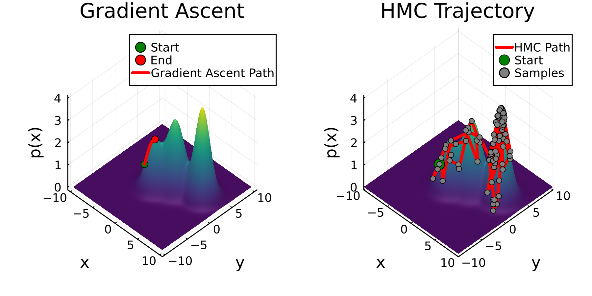

To think before one speaks is to consider a set of possible responses and choose the one that best conveys one's intent. This is a task that most humans do intuitively and quickly, but is not something that is easily incorporated into modern AI systems. Compared to the intricacy of large language model (LLM) architectures, the methods used to sample responses from an LLM, given a prompt, are simple and heuristic driven.

Given a prompt by the user, the LLM first decides which word out of all words in the dictionary should come first in its response. This decision is made by choosing the word with the highest estimated likelihood, given the model's training and the context provided in the form of a prompt. Note that at this point, the LLM has no information about the rest of its response to weigh in on its word choice.

Crucially, this initial word choice may end up being a mistake in the long run because the final likelihood of the generated response may have been higher if a different initial word had been chosen. This problem compounds with each word choice as sentences and paragraphs are constructed by the model. Unfortunately, it is impossible for LLMs to exhaustively search for the best response to a query. The space of all possible word combinations is astronomically large: for a vocabulary of size $V$ and a response length of $L$, the search space is $V^L$. For a modest $V=50,000$ and $L=50$, this is $50,000^{50}$ possible sequences — far beyond what can be exhaustively searched.

It is interesting that LLMs work as well as they do despite the relative simplicity of their sequence generation. This may be one reason why LLMs require such a large amount of training data relative to humans to generate meaningful language. Fortunately, LLMs contain additional information that can be used to generate responses more efficiently. The LLM's gradient, like the slope of a line, points in the direction of higher likelihood responses.

Two key questions arise:

1. To what extent are higher likelihood language samples associated with more nuanced, complex responses?
2. Can the gradient of the LLM's log likelihood, $\nabla \log{\hat{p}(x \mid \theta, c)}$, otherwise known as the score function, be used to generate a set of higher likelihood samples?

## Language Models

As far as one believes that humans convey their reasoning and knowledge through language, and as far as one believes that human language can be approximated by an arbitrarily complex statistical model, then we can propose that there is a probability distribution over all possible sequences of words $x = (x_1,\dots,x_n)$ that humans are likely to generate.

$$p(x)$$

Of course, the "true" nature of human language $p(x)$ is unknown and therefore requires mathematical approximation. Enter LLMs. The billions of weights inside an LLM encode correlations between words, sentences, and paragraphs. However, these weights represent only a static set of variables that are not capable of generating a sequence on their own. A method is required to "decode" the weights inside an LLM and generate language.

$$ x \mid c \sim p(x) $$

The challenge LLMs tackle is twofold: estimating $p(x)$ and then sampling (generating) a reply to a prompt $c$ that maximizes $p(x \mid c)$.

## Estimating $p(x)$ with an LLM

LLMs represent a transformational improvement in our ability to estimate the likelihood of human language. An LLM is a function $f$ parameterised by $\theta$, $f_\theta$, that consumes context $c$ and estimates the probability distribution over the vocabulary at each position $i$ within the generated sequence. For this reason, an LLM can be viewed as an approximating density for $p(x \mid c) \approx \hat{p}(x \mid \theta,c)$.

$$p(x \mid c) \approx \hat{p}(x \mid \theta,c)$$

$$\hat{p}(x \mid \theta,c) = f_\theta(x)$$

$$x_{\text{best}} = \underset{x}{\operatorname{argmax}} f_\theta(x)$$

The problem encountered by modern LLMs is that building a very good likelihood estimator was only half the problem. The other half is to sample the best response given context to the model. This is equivalent to finding the maximum of the likelihood function $f_{\theta}$. However, this requires checking all $L^V$ responses. As discussed above, this is an intractable problem.

## Peak Finding vs. Peak Mapping

Imagine you have decided to drop yourself at a random location in the middle of Himalayas. Your goal is to find the highest peak, Everest, by only walking upwards. Crucially, once any peak in the mountain range is reached, you can no longer climb upwards so the task must complete. There are 3,411 named peaks in the Himalayas, of which only 1 is Mt. Everest. Clearly it is quite improbable to find Mt. Everest by this method.

Now imagine that you once again find yourself in the middle of the Himalayas. Rather than only climbing until a peak is reached, you continuously move around in a way that respects these rules:

1. As you move uphill, you lose momentum and tend to make smaller moves
2. As you move downhill, you gain momentum and start making larger moves
3. In flat regions, your momentum doesn't change and you make large moves until you either start climbing again (1) or descending again (2)
4. You only stop moving after a pre-determined number of steps.

If this is done with an element of randomness, you will provably end up visiting peaks in the Himalayas proportionally to how high they are — virtually ensuring that you will eventually find the peak of Mt. Everest.

Mathematically, these algorithms can be expressed the following way and be used to generate the plots above:

**Gradient Ascent**

$$x_{i+1} \leftarrow x_i + \eta \nabla f_\theta(x_i)$$

**Gradient MCMC Samplers (HMC)**

$$p_{i+1/2} \leftarrow p_i + (\eta/2) \nabla f_\theta(x_i)$$

$$x_{i+1} \leftarrow x_i + \eta p_{i+1/2}$$

$$p_{i+1} \leftarrow p_{i+1/2} + (\eta/2) \nabla f_\theta(x_{i+1})$$

## Thinking like an LLM

Given these limitations, current LLM performance may be nowhere near its true level of knowledge or approximation of human language. It is possible that improvements to LLMs will come from a team of mathematicians and computer scientists in a few lines of math, rather than relying on exponentially more data.

Our brains effortlessly sample language with essentially no error, especially on common knowledge subjects. The frequent and nonsensical "hallucinations" of an LLM are essentially a poor estimate for $\max{f_{LLM}}$ that a human brain would never make.

As sampling algorithms for generative AI improves, we will get a better picture of the true level of knowledge store in modern LLMs. I strongly suspect that better exploration of the sequence space via improved markov-chain monte carlo methods or similar will result in improved AI performance despite the data ceiling.

## Notes

LLMs do not estimate the true likelihood of a sequence but rather the pseudolikelihood.

You generate an initial proposal response, but then reevaluate the response. You pass the initial response through the LLM which gives a probability/pseudolikelihood of the response. The calculation of that probability/pseudolikelihood is differentiable.

However my sampling choices at each position in the sequence are discrete, meaning they cannot be connected to this gradient. This is resolvable, potentially, by using a continuous relaxation calculation of the samples.

Initial → Continuous Relaxation → Gradient Updates → Final Argmax (tokens → Gumbel-Softmax → using $f_\theta$ → discrete tokens)

From Yang Song: When sampling with Langevin dynamics, our initial sample is highly likely in low density regions when data reside in a high dimensional space. Therefore, having an inaccurate score-based model will derail Langevin dynamics from the very beginning of the procedure, preventing it from generating high quality samples that are representative of the data.

^ We solve this maybe by doing a greedy beam search then optimize.
