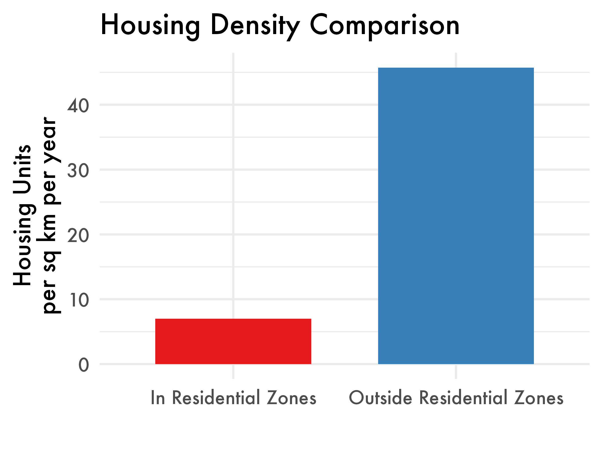
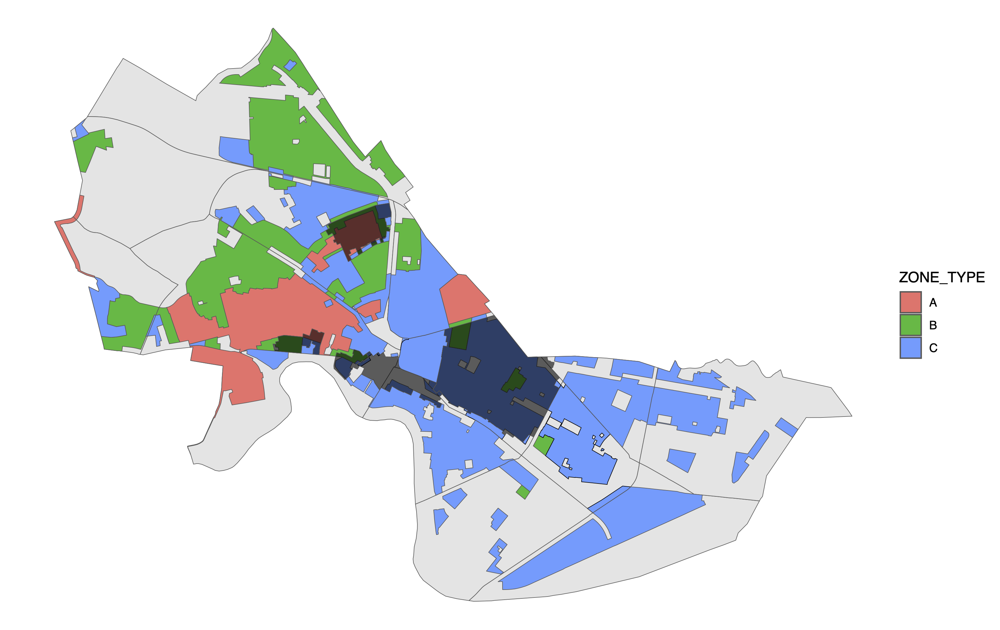
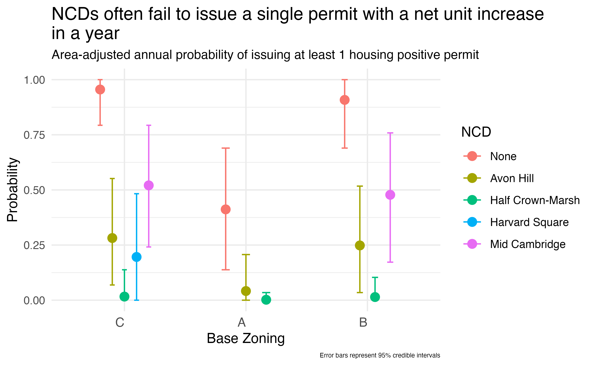
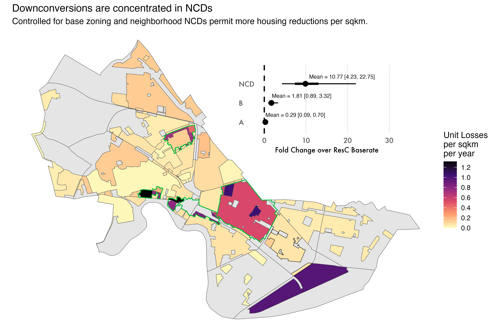

### tl;dr

0. Analyses were performed by controlling for area, base zoning, and neighborhood.
1. NCDs rarely issue even a single permit that has a net housing increase of at least 1 unit in an entire year.
2. The Mid-Cambridge NCD is ~50% less likely to issue a single housing-positive permit than an equivalent Res C plot of land outside the NCD per year.
3. The Half Crown-Marsh NCD stands in a world of its own, having issued no housing positive permits in the 29 year dataset.
4. NCDs are hotspots for down-conversion projects, and with more housing losses than comparable plots of land outside the NCD.
5. For projects that are net housing losses, NCDs are associated with a ~10 fold increase in the number of units lost, on average, compared to an equivalent Res C plot of land outside the NCD.

---

## Background

Cambridge is a small city immediately adjacent to Boston, Massachusetts with one of the worst housing crises in the country. Despite this, the city has done remarkably little to address the problem. Inside the city's residential districts, the city constructed a *cumulative* 1,848 housing units over 29 years from 1996 to 2024, which amounts to 0.06 housing units per 100 residents per year. Notably, large housing developments that occurred in the city's commercial districts are not counted here because they were not subject to the city's NCD oversight.



Cambridge's residential areas, importantly, are not near capacity. These areas contain large numbers of detached 1-2 family housing units, some on estate sized lots that would not be out-of-place in the exurbs. The city has repeatedly found that there is adequate resources and infrastructure to build more housing in these areas. The question is not if there should be development but why there isn't development in such a supply constrained market.

In 2025, the Cambridge city council passed one of the most sincere zoning reforms in the United States. With this accomplishment, the city government not only increased the allowable housing density across large regions of Cambridge, it also corrected the historical injustice of applying different housing rules to different neighborhoods with absolutely no underlying environmental or infrastructural justification.

### Neighborhood Conservation Districts (NCDs)

NCDs were established by the city council in 1983 in an effort to protect the character of wealthy neighborhoods in the city from further development. According to the Cambridge Historical Commission's (CHC) website, these districts were founded to be "more effective" than zoning and more flexible than historic districts. Perhaps sensing that elected officials are suspicious, CHC goes to great lengths to describe that NCDs are "not intended to stop development" and that they approve 96.9% of applications.



| Neighborhood Conservation District | Total Net Housing Change (1996-2024) |
|---|---|
| None (Non-NCD Areas) | 1862 |
| Avon Hill | -5 |
| Half Crown-Marsh | -6 |
| Harvard Square | -6 |
| Mid Cambridge | 3 |

: Net Housing Change by NCD Status, not adjusted for area.

When considering the impact of NCDs, it is important to consider what they are *not* allowed to do:

1. NCDs are not allowed to impose dimensional or setback restrictions greater than the base zoning
2. Cannot consider size and shape ("massing")
3. Limited to considering incongruity within the district

In spite of this, NCDs have the power to issue binding decisions that can prevent permit issuance for a project with almost no oversight from the city council. Given that NCDs are forbidden from flouting the base zoning(s) of the district they reside within, if CHC's claim is true that they issue approval 96.9% of applications then there should not be statistically meaningful differences in housing permits after controlling for neighborhood, base zoning(s), and area.

To determine if this is true, I examined the citywide dataset of housing starts and found statistically significant evidence that NCDs act as an independent suppressor on housing in Cambridge. The raw data says enough on its own: housing production in Avon Hill, Half Crown-Marsh, and Harvard Square has been *negative* over the past 29 years. In the same time span, the Mid Cambridge NCD has managed to add 3 housing units inside an area that is nearly a square kilometer.

This is an important problem because the city recently upzoned all A and B regions of the city to C. If NCDs suppress housing, this will diminish the impact of the law.

## Results

One of the more remarkable aspects of the housing starts dataset is that Cambridge simply builds almost no housing, inside or outside of NCDs. This makes separating the effect of NCDs from base zoning a challenging task, particularly when considering NCDs that are a fraction of a square kilometer. The relevant statistical question, therefore, is pretty simple: do plots of land of comparable area and base zoning issue fewer housing permits when located within an NCD?

Interestingly, *when* there is a housing positive development approved inside an NCD there is no statistical evidence that the number of units added is different from an equally zoned region outside the NCD (mean NCD fold change = 1.03 ± 0.52).

### NCDs Issue Fewer Housing Positive Permits Than Other Equal Area/Equal Zoned Regions

There is a large difference in the number of years for which there was *at least 1* (yes just 1) net housing increase permit issued between NCDs and not-NCD areas. The results are striking: In nearly all cases, NCDs have substantially more years without *any* housing positive permits issued. Mid-Cambridge, the largest NCD with the most available data, gives the clearest picture of the effect by having an estimated ~50% reduction in the probability of issuing at least one permit for housing addition in an otherwise equivalent area.



### NCDs Are Down-conversion Hotspots

Perhaps more concerning than the rarity of housing unit increases is the concentration of down-conversions inside NCDs as compared to the remainder of the city. Indeed, after splitting the data into permits with net removals or net additions and examining the removals in isolation it is clear that NCDs have a strong and statistically significant effect that is associated with a large multiplicative increase (average fold change ~10) in the unit loss rate.



This is strong evidence that NCDs preferentially approve permits that are net housing losses. It is also reflective of the very real chilling effect that NCDs have on developers: why spend months battling against an unaccountable group and endless carrying costs when the lot can simply be converted into a single family residence?

---

## Methods

R code and data are available at the [GitHub repo for this project](https://github.com/dan-sprague/CambridgeHousing).

### Data Sources and Preparation

Data sources included GeoJSON files of NCD boundaries, residential districts, zoning districts, and neighborhood boundaries, alongside housing starts from 1996 to present, containing building permit and housing unit change data. Area calculations for each spatial unit were calculated in square kilometers. Zoning district areas were adjusted to account for NCD overlaps to ensure accurate density measurements.

Two specific cases inside the data were adjusted to correct for errors:

1. **125 Harvard St** — The dataset incorrectly attributed the Geocode address to 345 Harvard St, which falls within the Mid Cambridge NCD. The correct lat and lon were added for this entry.
2. **273 Harvard St** — This development converted a nursing home into an assisted living for senior facility. Records do not exist for the number of beds present at this location prior to its reconstruction. The development was removed from the dataset.

### Spatial Analysis

Spatial joins connected housing data with corresponding geographic areas. Each development was assigned attributes indicating NCD status, specific NCD name (if applicable), residential district, zoning type (A, B, or C), and neighborhood name.

Housing data was filtered to exclude entries with missing coordinates or undefined net unit changes. Data was aggregated by year and geography, with zero values included for years without recorded housing activity for each unique combination of NCD, Neighborhood, Assessing District, and Zoning Area.

### Metrics

Many projects have negative net unit swings, which cannot be directly modeled by count distributions most appropriate for this data. For this reason, the data were split into three categories:

1. Housing additions (positive net change)
2. Housing removals (absolute value of negative net change)
3. Housing starts (permits with positive net change per year)

All metrics were normalized by geographic area for valid cross-district comparisons.

### Statistical Modeling

Bayesian generalized linear models (GLMs) were used to fit the relationship between NCDs and housing development while controlling for other factors. Due to the preponderance of zero observations and high variance of unit changes, zero-inflated negative binomial likelihoods were used for the housing additions and removals. For the permit starts data, a beta-binomial likelihood was used to account for overdispersion in binary outcome data.

**Housing Additions Model** — Zero-inflated negative binomial:

```r
model_additions <- brm(
  housing_added ~ Zoning + IsNCD + (1 | Year.Permitted) + (1 | Neighborhood_name) + offset(log(area)),
  data = modeling_data,
  family = zero_inflated_negbinomial(),
  chains = 8,
  iter = 1000,
  cores = 8)
```

**Housing Removals Model** — Zero-inflated negative binomial:

```r
model_removals <- brm(
  housing_removed ~ Zoning + IsNCD + (1 | Year.Permitted) + (1 | Neighborhood_name) + offset(log(area)),
  data = modeling_data,
  family = zero_inflated_negbinomial(),
  chains = 8,
  iter = 1000,
  cores = 8)
```

**Permit Starts Model** — Beta-binomial:

```r
model_starts <- brm(
  permit_start | trials(total_years) ~ Zoning + IsNCD + (1 | Neighborhood_name),
  data = modeling_data,
  family = beta_binomial(),
  chains = 8,
  iter = 1000,
  cores = 8)
```
